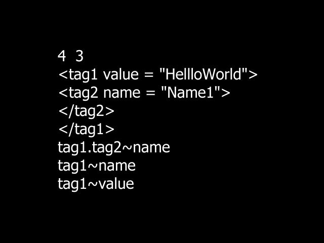

# Misc.Proj.Qt
A personal repo for learning more about Qt and for mashing up code and ideas taken from elsewhere. The primary motivation here is to roll out GUI projects built using the Qt framework.

## Attribute Parser (Qt, C++)

<ins>Brief</ins>: Parse a custom-made markup language called *HRML* and run queries on it. Much like HTML, each element is bracketed by a start- and end-tag, with attributes embedded in each tag. Given a markup stream consisting of *N* lines, our program processes *Q* queries about an attribute of an HRML element. See this [PDF](docs/HR_AP_challenge.pdf) for the original coding challenge.

<ins>Usage</ins>: Here is a simple input and output of the console version of this application.

###Sample Input###

###Sample Output###

In a Linux console, here is how to run the application with a test input file.

`$> cat 03_test00_input.txt | ./03_Attribute_Parser`
