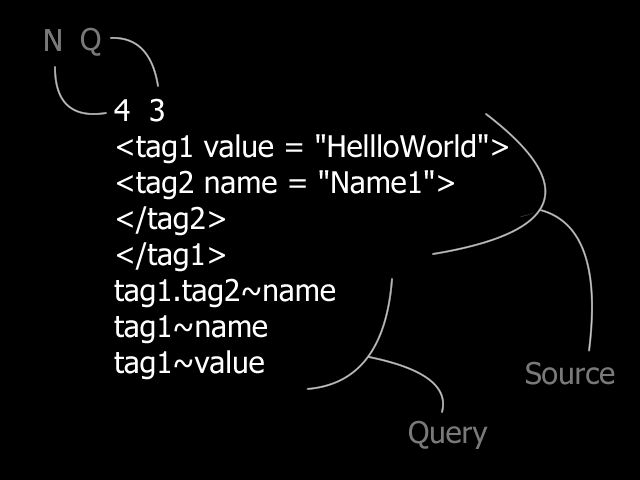

# Misc.Proj.Qt
A personal repo for learning more about Qt and for mashing up code and ideas taken from elsewhere. The primary motivation here is to roll out GUI projects built using the Qt framework.

## Attribute Parser (Qt, C++)

<ins>Project Brief</ins>: Parse a custom-made markup language called *HRML* and run queries on it. Much like HTML, each element is bracketed by a start- and end-tag, with attributes embedded in each tag. Given a markup stream consisting of *N* lines, our program processes *Q* queries about the attributes of the given HRML element. 

This project was inspired by a HackerRank challenge. The solution invovled rudimentary string processing, the use of STL data structures, and a fair amount of regular expressions. See this [PDF](Attribute_Parser/docs/HR_AP_challenge.pdf) for the original specs.

<ins>Console Usage</ins>: Here is a simple input and output of the command line version of this application.

### Sample Input ###

### Sample Output ###

The project was developed in a Linux environment where we use a shell console to *pipe* a test input file to the executable. In the sample shown below, the text file, *test00_input.txt*, contains a line encoding the *N* and *Q* parameters, then a series of HRML statements, followed by a series of queries -- essentially, the sample input show above. The program *Attribute_Parser* returns the exact same output as the example shown above as well.

`$> cat test00_input.txt | ./Attribute_Parser`

See the [test](https://github.com/csaatechnicalarts/Misc.Proj.Qt/tree/main/Attribute_Parser/test) directory for a collection of test inputs and expected outputs.
